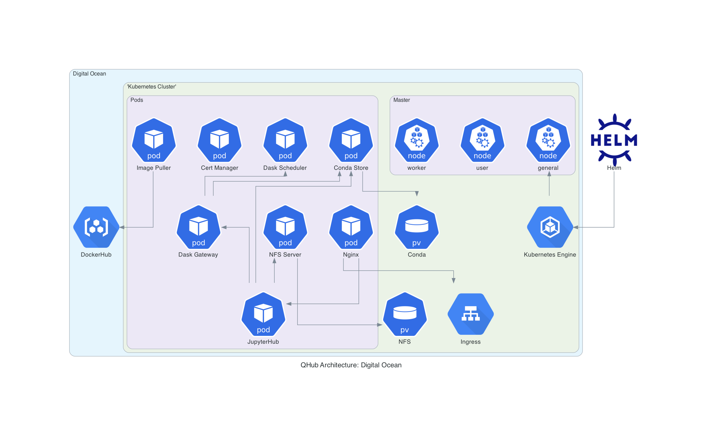

# QHub for Producers


Producers are those who would want to have control over their deployment components. If you are a **DevOps engineer**, **a system administrator**, **a network architect**, or someone who would like to better understand how QHub architecture is designed and how it can be modified or maintained, you will find this section of the QHub documentation most useful. 

+ **Why QHub?**

    + With QHub, managing configurable data science environments and seamless deployment with [**Github Actions**](https://github.com/marketplace/actions/deployment-action) become remarkably easy. Let's look at how you can customize QHub for a data science architecture that meets  **your team's needs**. 
    


## Configuring QHub

    - Manage configurable data science environments 
    - seamless deployment with github actions
    - have to manage many environments in a robust way
    - have multiple teams --> concerned with permissions

QHub is entirely controlled from a configuration file, which allows you to manage multiple environments and multiple teams, as well as their permissions and authorization in a robust way. 


### The Congifuration File

QHub comes with configuration file templates for each of the cloud providers it currently supports: **Amazon Web Services (AWS)**, **Digital Ocean (DO)**, and **Google Cloud Platform (GCP)**. The templates can be found [**here**]('#'). 


## QHub Architecture 
- they are concerned with Dask, Conda, Jhub, and kubernetes


+ **Digital Ocean Deployment**





+ **Google Cloud Platform Deployment**


## Autoscaling
- concerned with the day to day maintenance of each team's equipment 
    - autoscaling of computers (kubernetes and pods)
    
    
    Dask autoscaling with CPU & GPU workers
OAuth Integration (we are using github)
Staging & Production JupyterHub deploys
Staging & Production shell access 

    
    
    
    
```{toctree}
:maxdepth: 2
:glob:

docs/aws/index
docs/do/index
docs/gcp/index
