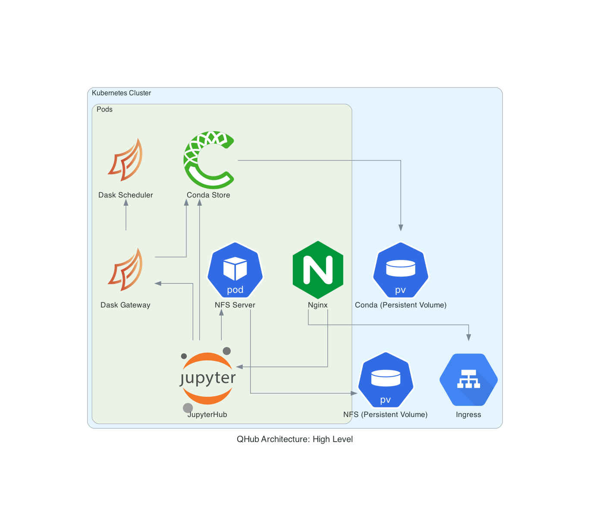

# **Q|Hub for Admins**

Q|Hub admins are **DevOps engineers**, **system administrators**, **scientists**, and **network architects** who are responsible for the critical infrastructure that data scientists and engineers need to thrive. Q|Hub is bundled with features that make installation easy while providing the ability to scale with your organization and data.

> The content below is particularly for Q|Hub producers and those looking to learn more about the Q|Hub architecture.

## Why Q|Hub

With Q|Hub, managing configurable data science environments and attaining seamless deployment with [**Github Actions**](https://github.com/marketplace/actions/deployment-action) become remarkably easy. Let's look at how you can customize Q|Hub for a data science architecture that meets  **your team's needs**.

### Staging & Production Environments and Shell Access

TODO: 
Staging & Production JupyterHub deploys
Staging & Production shell access

Shell access and remote editing access (i.e. VSCode remote) through KubeSSH
Full linux style permissioning allowing for different shared folders for different groups of users  

Robust compute environment handling that will allow for both prebuilt and ad-hoc environment creation.

-----------

## Q|Hub Architecture

 In addition to a robust integration of [**Dask**](https://dask.org/) and a new way of distributing environments with [**conda-store**](https://github.com/quansight/conda-store), Q|Hub brings together some of the widely used cloud deployment components in its architecture, as depicted in the diagram below. Q|Hub integrates [**Network File System (NFS)**](https://en.wikipedia.org/wiki/Network_File_System) protocol is used to allow Kubernetes applications to access storage. Files in containers in a [**Kubernetes Pod**](https://kubernetes.io/docs/concepts/workloads/pods/pod/) are not persistent, which means if a container crashes, [**kubelet**](https://kubernetes.io/docs/reference/command-line-tools-reference/kubelet/#:~:text=Synopsis,object%20that%20describes%20a%20pod) will restart the container, however, the files will not be preserved. The [**Kubernetes Volume**](https://kubernetes.io/docs/concepts/storage/volumes/#types-of-volumes) abstraction that Q|Hub utilizes solves this problem. NFS shares files directly from a container in a Kubernetes Pod, and sets up a [**Kubernetes Persistent Volume**](https://kubernetes.io/docs/concepts/storage/persistent-volumes/) accessed via NFS. Kubernetes' built‑in configuration for HTTP load balancing [**Ingress**](https://kubernetes.io/docs/concepts/services-networking/ingress/) defines and controls the rules for external connectivity to Kubernetes services. Users who need to provide external access to their Kubernetes services create an Ingress resource that defines rules.

Q|Hub streamlines and manages all the Kubernetes architecture detailed above and delivers a smooth deployment process to its users through its intuitive interface.


Q|Hub architecture and features allows you to:

+ manage configurable data science environments

+ handle multiple environments in a robust way

+ have seamless deployment with github actions

+ meet the needs of multiple teams and control permissions

## Installation

You can install Q|Hub through `pip`:

    pip install qhub-ops

After the installation, the neext step is to configure Q|Hub.

## Configuration

Q|Hub is entirely controlled from a configuration file, which allows you to manage multiple environments and multiple teams, as well as their permissions and authorization in a robust way.

+ **The Configuration File**
  + Q|Hub comes with configuration file templates for each of the cloud providers it currently supports: **Amazon Web Services (AWS)**, **Digital Ocean (DO)**, and **Google Cloud Platform (GCP)**. The templates can be found [**here**]('#').

## Cloud Deployment on Q|Hub

Q|Hub deployments on the clouds follow the architectural structure shown for ech provider in the diagrams below. To make cloud depeloyments, the respective configuration file needs to be configured based on the user's cloud provider account credentials, as well as the details of users they would allow access to the deployment.

### AWS Deployment

The configuration file template for AWS can be found at the following path:

    tests/assets/config_aws.yaml

[QHub AWS Architecture](#)

### DO Deployment

The configuration file template for Digital Ocean can be found at the following path:

    tests/assets/config_do.yaml

[QHub DO Architecture](#)

### GCP Deployment

The configuration file template for GCP can be found at the following path:

    tests/assets/config_gcp.yaml

[QHub GCP Architecture](#)

### Autoscaling

With Q|Hub, system admins can customize and maintain their teams' compute needs and environments. The autoscaling of computers (Kubernetes and Pods) is done through Dask autoscaling with CPU & GPU workers.

### Authentication

Q|Hub uses Github for authentication. 

```{toctree}
:maxdepth: 2
:glob:

docs/aws/index
docs/do/index
docs/gcp/index
```
